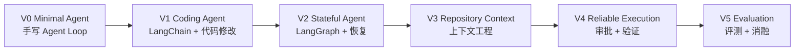

# ForgeCode 项目完整规划

> A minimal repository-aware coding agent built for learning, experimentation, and technical interviews.

## 1. 项目定位

ForgeCode 是一个使用 Python 构建的轻量级终端 Coding Agent。它能够理解自然语言形式的编码任务，探索本地代码仓库，调用文件与命令工具，修改代码，运行测试，并根据真实环境反馈继续修复。

示例：

```bash
forge "修复登录接口在用户不存在时返回 500 的问题，并补充测试"
```

预期执行过程：

```text
理解任务
→ 探索仓库
→ 定位相关代码
→ 制定或调整行动计划
→ 读取、搜索和修改文件
→ 执行测试或检查命令
→ 根据失败信息继续修复
→ 验证结果
→ 输出修改摘要
```

ForgeCode 不以复刻成熟商业 Coding Agent 为目标。项目追求的是：

> 用克制、透明、可验证的实现，完整理解 Coding Agent 的关键机制，并能够在面试中基于真实代码和实验讲清楚设计与取舍。

## 当前进度

- V0 — Minimal Agent：已实现、测试并推送；
- V1 — Coding Agent：已实现 LangChain 工具、代码修改和 Git diff；
- V2 及之后：等 V1 的真实任务回归和面试复盘完成后再进入。

---

## 2. 核心目标

### 2.1 学习目标

通过逐版本实现，真正掌握以下概念：

```text
Agent Loop
ReAct
Tool Calling
Messages
Tool Schema
Tool Result
State
Planning
Checkpoint
Thread / Resume
Context Engineering
Repository Map
Symbol Search
Tool Safety
Human-in-the-Loop
Verification
Agent Evaluation
Ablation
Failure Analysis
```

对每个进入项目的核心模块，都应该能够回答：

1. 它解决什么问题？
2. 它是如何实现的？
3. 为什么选择这种设计？
4. 它有什么限制？
5. 是否有代码、Demo 或实验支持结论？

### 2.2 项目目标

最终形成一个具备以下能力的本地 Coding Agent：

- 能通过工具探索真实代码仓库；
- 能在受控工作区内修改代码；
- 能执行测试、Lint、类型检查或构建命令；
- 能根据失败结果继续迭代；
- 能保存并恢复长任务状态；
- 能在较大仓库中选择少量相关上下文；
- 能对高风险操作请求用户批准；
- 能记录完整轨迹并进行可重复评测。

### 2.3 面试目标

最终项目应能支持一段清晰的项目叙事：

> 我先手写了最小 Tool-Calling Agent Loop，理解模型、工具和环境之间的交互；随后使用 LangChain 标准化消息和工具接口，再用 LangGraph 解决状态管理、任务恢复和人机协作；之后重点研究 Coding Agent 的仓库上下文选择与执行验证，最后通过自建任务集和消融实验分析各模块的实际价值。

---

## 3. 非目标

主线完成前，不主动建设以下内容：

- 复杂 Web UI；
- 微服务架构；
- Kafka、Kubernetes 等分布式基础设施；
- 大规模向量数据库或 GraphRAG；
- 复杂长期记忆系统；
- 大量 MCP Server；
- 默认 Multi-Agent 架构；
- 多模型路由平台；
- 完整云端商业化部署。

这些能力只有在主线完成，并且能够回答明确问题时，才作为独立实验加入。

---

## 4. 开发原则

### 4.1 优先级

```text
理解 > 功能数量
核心机制 > 技术堆砌
真实可验证 > 看起来高级
简洁设计 > 过度工程
可解释的取舍 > 盲目遵循框架
```

### 4.2 框架使用原则

- 第一次学习某个核心机制时，优先选择透明、容易理解的实现；
- 理解机制后，使用 LangChain、LangGraph 等成熟抽象减少重复代码；
- 不直接依赖一次性生成完整系统的高级 Agent 工厂；
- 不为了表现“底层”而重复实现成熟框架已经可靠解决的问题；
- 框架升级时，以概念和行为为主，不让项目价值依赖某个短期 API。

### 4.3 学习闭环

每个版本按以下流程进行：

1. 检查当前代码和上一版本遗留问题；
2. 明确本版需要回答的核心问题；
3. 设计能够回答问题的最小实现；
4. 编写代码与必要测试；
5. 运行真实 Demo；
6. 分析至少一个失败或边界案例；
7. 由项目作者亲自完成一个小扩展；
8. 用自己的语言复述核心机制；
9. 整理面试问题和版本总结；
10. 打 Git Tag，停止并决定是否进入下一版。

---

## 5. 总体演进路线



| 版本 | 核心问题 | 主要成果 |
| --- | --- | --- |
| V0 | Agent 为什么能够连续行动？ | 手写 Tool-Calling Loop |
| V1 | Agent 如何可靠地操作代码仓库？ | 可完成简单 Bug Fix 的 Coding Agent |
| V2 | while-loop 何时不够用？ | 可持久化和恢复的 LangGraph Agent |
| V3 | 大仓库中应该给模型什么上下文？ | 轻量 Repository Context 系统 |
| V4 | 如何让执行过程更可靠？ | Worktree、HITL、Verification Loop |
| V5 | 前面的设计真的有价值吗？ | Mini Benchmark、消融实验、失败分析 |

---

## 6. 建议技术栈

技术栈按版本逐步引入，不在项目初始化时一次性安装全部依赖。

### 基础技术

- Python 3.11 或更新稳定版本；
- `pyproject.toml` 管理项目配置；
- `pytest` 编写测试；
- `ruff` 负责格式和基础静态检查；
- 完整 type hints；
- `subprocess` 执行本地命令；
- 标准库 `pathlib` 处理路径。

### 按需引入

- V0：一个支持 Tool Calling 的模型 SDK；
- V1：LangChain Core 与对应模型集成；
- V2：LangGraph 和本地持久化组件；
- V3：Python AST、Tree-sitter 或其他符号分析工具；
- V4：Git Worktree，必要时增加 Docker Sandbox；
- V5：数据分析和可视化库按实验需要引入。

### 暂不追求

- 同时支持大量模型厂商；
- 完整插件系统；
- 复杂依赖注入框架；
- 为未来假设需求设计大量接口。

首个版本优先支持一个模型提供方。只有当第二个实现真正出现时，再抽象稳定的 Provider 接口。

---

## 7. V0 — Minimal Agent

### 7.1 目标

手写一个最小但完整的 Tool-Calling Agent Loop，理解以下闭环：

```text
User Message
→ Model Response
→ Tool Call
→ Tool Execution
→ Tool Result
→ Model Response
→ Final Answer
```

本版不使用 LangChain 或 LangGraph 的 Agent 高级封装。

### 7.2 必须掌握的知识

- System、User、Assistant、Tool Message 的职责；
- Tool Schema 如何描述工具及参数；
- 模型只负责生成 Tool Call，而不是亲自执行工具；
- Agent Runtime 如何分发和执行 Tool Call；
- Tool Result 为什么必须回填到消息历史；
- ReAct 与 Tool Calling 的关系；
- Agent Loop 的停止条件；
- Tool Error 如何成为下一轮 Observation；
- 模型边界与执行环境边界。

### 7.3 功能范围

实现以下工具：

- `list_files`：浏览仓库文件；
- `read_file`：读取指定文件或范围；
- `search_text`：在仓库中搜索文本；
- `run_command`：在当前受控练习仓库中运行命令。

基础运行约束：

- 工作目录固定在目标仓库；
- 文件路径不能越过仓库根目录；
- 命令有超时；
- Tool 输出有长度上限；
- Agent 有最大步骤数；
- 未知工具和参数错误返回结构化 Tool Error。

这些约束的目的主要是帮助理解 Agent Runtime 的边界，不在 V0 建设完整安全平台。

### 7.4 最小核心对象

```text
AgentLoop       驱动模型与工具之间的循环
ModelClient     发送消息并返回模型响应
Tool            描述 Schema 并执行调用
ToolRegistry    根据工具名分发调用
RunConfig       保存最大步骤、超时等配置
RunResult       保存最终回答、停止原因和执行统计
```

保持对象数量克制。只有在能够改善测试或解释边界时才建立抽象。

### 7.5 建议目录

```text
forgecode/
├── pyproject.toml
├── README.md
├── src/
│   └── forgecode/
│       ├── __init__.py
│       ├── cli.py
│       ├── agent.py
│       ├── model.py
│       ├── schemas.py
│       ├── prompt_template.py
│       └── tools/
│           ├── __init__.py
│           ├── base.py
│           ├── filesystem.py
│           └── command.py
├── tests/
│   ├── fixtures/
│   ├── test_agent_loop.py
│   ├── test_tools.py
│   └── test_limits.py
└── docs/
    └── versions/
        └── v0.md
```

实际实现时允许根据代码复杂度合并文件，不为了符合目录图制造空模块。

### 7.6 测试重点

使用可脚本化的 Fake Model 测试 Agent Loop，避免所有测试都依赖真实 API：

- 模型直接返回最终答案；
- 模型调用一次工具后返回答案；
- 模型连续调用多个工具；
- 工具不存在；
- 工具参数错误；
- 工具执行失败；
- 达到最大步骤后停止；
- 路径越过仓库根目录时拒绝执行；
- 命令超时；
- 超长输出被截断。

### 7.7 Demo

选择一个小型示例仓库，让 Agent 完成代码理解任务：

```text
“这个项目的入口在哪里？配置是如何加载的？请基于文件给出说明。”
```

Demo 必须展示至少两次工具调用，并输出可读的执行轨迹。

### 7.8 完成标准

- 可以从 CLI 输入一个代码理解任务；
- Agent 能读取和搜索仓库；
- 能根据 Tool Result 继续决策；
- 能正确处理工具失败；
- 有明确停止条件；
- 核心循环拥有不依赖真实模型的自动化测试；
- 能结合代码完整解释一次执行轨迹。

### 7.9 作者练习

从以下任务中至少亲自完成一个：

- 新增 `file_info` 工具；
- 实现 `max_steps` 停止逻辑；
- 为 Tool Error 增加测试；
- 为 Tool 输出增加截断信息。

### 7.10 面试验收问题

- 普通 Chat 调用和 Agent 有什么区别？
- 模型如何知道有哪些工具？
- 模型调用工具时，真正执行代码的是谁？
- Tool Result 应该以什么角色加入消息？
- 如果工具失败，为什么不应该立即终止整个 Agent？
- 如何防止 Agent 无限循环？
- Fake Model 为什么能让 Agent Loop 更容易测试？

### 7.11 停止边界

V0 不实现：

- 修改已有代码；
- LangChain；
- LangGraph；
- Planner；
- Checkpoint；
- Repo Map；
- HITL；
- 完整 Benchmark。

建议 Git Tag：`v0-minimal-agent`

---

## 8. V1 — Coding Agent

### 8.1 目标

使用 LangChain 的标准消息与工具抽象，把只读 Agent 扩展为能够完成简单代码修改的 Coding Agent。

### 8.2 必须掌握的知识

- LangChain Message 与 V0 原始消息的对应关系；
- Tool Decorator、参数 Schema 与 Tool Result；
- Tool Schema 的描述如何影响模型行为；
- 代码编辑工具的不同设计；
- Shell、Git Diff 和测试结果如何形成环境反馈；
- Streaming 是展示机制还是决策机制；
- 框架抽象减少了哪些代码，又隐藏了哪些过程。

### 8.3 功能范围

新增或完善：

- `apply_patch` 或等价的局部编辑工具；
- `create_file`；
- `git_diff`；
- `run_command`；
- 测试执行；
- 可读的流式终端输出；
- 修改完成后的摘要。

优先使用局部 Patch 修改已有文件，避免每次覆盖完整文件。

### 8.4 典型循环

```text
Explore
→ Read
→ Edit
→ Test
→ Observe Failure
→ Edit Again
→ Test Pass
→ Summarize
```

### 8.5 测试重点

- Patch 正常应用；
- Patch 上下文不匹配；
- 创建文件与重复创建；
- 修改后 Git Diff 正确；
- 测试失败结果能够反馈给模型；
- Agent 不应在未验证时默认宣称测试通过；
- 一次简单 Bug Fix 的端到端测试。

### 8.6 Demo

准备一个带有明确失败测试的小仓库，例如：

```text
“修复用户不存在时访问属性导致的异常，并补充测试。”
```

展示完整过程：定位、修改、第一次测试、必要时再次修改、测试通过、Diff 总结。

### 8.7 完成标准

- Agent 能独立完成至少一个简单 Bug Fix；
- 最终结果包含文件变更和验证情况；
- Tool Error 会进入下一轮决策；
- 能对比 V0 和 V1，说明 LangChain 带来的价值与代价；
- 建立 3～5 个固定回归任务。

### 8.8 作者练习

- 亲自设计一个编辑工具的参数 Schema；或
- 增加一个失败测试，让 Agent 根据测试输出修复；或
- 修改 Tool 描述并观察 Agent 行为变化。

### 8.9 面试验收问题

- 为什么编辑工具的接口会影响 Agent 成功率？
- Patch 与整文件重写各有什么优缺点？
- LangChain 在项目中解决了什么？
- Streaming 是否会改变 Agent 的推理结果？
- 如何让测试失败成为下一步行动依据？

### 8.10 停止边界

V1 不实现完整状态图、任务恢复、Repo Map 或复杂审批系统。

建议 Git Tag：`v1-coding-agent`

---

## 9. V2 — Stateful Agent

### 9.1 目标

使用 LangGraph 将 Coding Agent 重构为显式、可观察、可持久化和可恢复的 Stateful Agent。

### 9.2 核心问题

> 一个简单 while-loop 在任务变长、状态变多、需要暂停恢复时，为什么逐渐不够用？

### 9.3 必须掌握的知识

- State、Node、Edge、Conditional Edge；
- Graph State 与消息历史的关系；
- ToolNode 的职责；
- Checkpoint 与 Thread；
- Thread ID 如何定位任务状态；
- Resume 如何继续执行；
- Checkpoint 与长期记忆的区别；
- 状态合并与 Reducer；
- 图结构与普通控制流之间的关系。

### 9.4 最小图结构

```text
START
  ↓
agent_node
  ├── tool_calls → tool_node → agent_node
  └── final      → END
```

先用最小图复现 V1 的行为，再逐步增加状态和恢复，不为了使用 LangGraph 而画出复杂流程图。

### 9.5 功能范围

- 使用 StateGraph 表达 Agent Loop；
- 保存 messages、任务状态、步骤计数和统计；
- 使用本地持久化 Checkpointer；
- 使用稳定 thread ID；
- 支持程序退出后的任务恢复；
- 展示执行状态与当前阶段；
- 可选的轻量计划列表；
- 更完整的步骤、Tool Call、Token 或时间预算。

Planner 作为可开关实验能力，而不是默认假设它一定有效。

### 9.6 测试重点

- 条件路由正确；
- 达到预算后进入对应终止状态；
- 相同 thread ID 能恢复任务；
- 新 thread ID 创建独立任务；
- 进程重启后本地 Checkpoint 仍然存在；
- 恢复后不会丢失已有 Tool Result；
- Planner 开启和关闭时都能运行。

### 9.7 Demo

执行一个多步骤任务，在完成部分探索或修改后主动停止进程；重新运行 CLI，使用相同 thread ID 继续，最终完成任务。

### 9.8 完成标准

- V1 行为已经迁移到 LangGraph；
- 任务状态可以持久化；
- 程序重启后能够恢复；
- 能画出并解释当前状态图；
- 能解释 Checkpoint、Thread、Resume 和 Planning 的关系；
- 能说明哪些问题仍然用 while-loop 更简单。

### 9.9 作者练习

- 增加一个新的状态字段和 Reducer；或
- 实现 thread 列表与恢复命令；或
- 实现 Planning 开关并比较一次任务轨迹。

### 9.10 面试验收问题

- LangGraph 与普通 while-loop 的本质差别是什么？
- State 为什么不能无限存放所有原始内容？
- Checkpoint 和 Memory 有什么区别？
- thread ID 的作用是什么？
- 恢复任务时，哪些操作可能被重新执行？
- 为什么 Planner 可能增加成本却不提高成功率？

### 9.11 停止边界

V2 不建设复杂分布式状态系统或长期用户画像。

建议 Git Tag：`v2-stateful-agent`

---

## 10. V3 — Repository Context

### 10.1 目标

研究 Coding Agent 的核心问题之一：在无法读取整个仓库时，如何找到并组织真正相关的代码上下文？

### 10.2 必须掌握的知识

- Context Window 与 Context Budget；
- Repository Tree 的信息价值；
- lexical search、symbol search 和语义检索的差异；
- 代码定位与答案生成是两个不同问题；
- Repo Map 的内容和粒度；
- Tool Output Compression；
- 检索召回率与上下文噪声的平衡；
- 为什么 Coding 场景不一定首先需要向量数据库。

### 10.3 分阶段实现

#### 阶段 A：Repository Tree

- 尊重 `.gitignore`；
- 排除常见构建目录和二进制文件；
- 控制最大深度和文件数量；
- 提供紧凑目录摘要。

#### 阶段 B：Lexical Search

- 文本和正则搜索；
- 文件类型过滤；
- 上下文行数控制；
- 结果去重和截断。

#### 阶段 C：Symbol Extraction

- 先支持主要语言；
- 提取类、函数、方法、导入关系等符号；
- 可先使用 Python AST，再根据需要引入 Tree-sitter；
- 支持符号名搜索与定义定位。

#### 阶段 D：Lightweight Repo Map

Repo Map 可以包含：

```text
文件路径
主要符号
模块说明
关键依赖或引用
文件规模
```

#### 阶段 E：Relevant Context Selection

- 根据任务词、路径、符号和搜索命中排序候选文件；
- 为读取内容分配 Token 预算；
- 压缩重复和低价值输出；
- 允许 Agent 继续主动搜索，而不是一次性猜出所有上下文。

### 10.4 对比实验

至少比较：

```text
A. 仅目录 + grep
B. 目录 + grep + symbol search
C. 目录 + grep + symbol search + repo map / ranking
```

记录：

- 是否定位到正确文件；
- 首次命中相关文件所需 Tool Calls；
- 读取文件数量；
- Context Token；
- 最终任务是否成功；
- 总耗时。

### 10.5 Demo

选择一个明显大于前两版 Fixture 的真实仓库。Agent 不读取整个仓库，只通过上下文工具找到少量相关文件并完成代码理解或小型修改任务。

### 10.6 完成标准

- 能生成紧凑 Repository Tree 或 Repo Map；
- 能进行文本与符号搜索；
- 有明确 Context Budget；
- Tool 输出能够截断或压缩；
- 至少完成一组上下文策略对比；
- 能结合轨迹解释 Agent 为什么选中了这些文件。

### 10.7 作者练习

- 为一种语言实现符号提取；或
- 设计候选文件排序公式；或
- 分析一个 Context Failure 并改进检索。

### 10.8 面试验收问题

- 为什么不能直接把整个仓库发给模型？
- grep、symbol search 和向量检索分别适合什么场景？
- Repo Map 解决了什么问题？
- 如何判断上下文检索是否有效？
- 上下文越多为什么不一定越好？

### 10.9 停止边界

V3 不为了加入 RAG 关键词而引入复杂向量数据库或知识图谱。

建议 Git Tag：`v3-repository-context`

---

## 11. V4 — Reliable Execution

### 11.1 目标

让 ForgeCode 不仅能够修改代码，而且能够以更可控、更可信的方式完成任务。

### 11.2 核心模块

#### Workspace Isolation

- 为任务创建独立 Git Worktree；
- 保留用户主工作区；
- 每个任务拥有独立分支或工作目录；
- 任务结束后展示 Diff 和验证结果。

Worktree 解决的是修改隔离和可恢复性。若需要运行不可信仓库，再把 Docker 或其他 Sandbox 作为独立增强项。

#### Permission / HITL

为工具定义简单风险等级：

```text
LOW     读取文件、搜索、查看 Diff
MEDIUM  修改工作区文件、运行常规测试
HIGH    安装依赖、联网、删除文件、执行特殊命令
```

低风险操作自动执行，高风险操作通过 LangGraph interrupt 暂停并请求批准。审批界面至少展示：

- 工具名；
- 完整参数；
- 工作目录；
- 风险原因；
- 批准、拒绝或修改操作。

#### Verification Loop

建立显式反馈闭环：

```text
Edit
→ Verify
→ Fail
→ Parse Feedback
→ Fix
→ Verify
→ Pass
```

验证来源包括：

- pytest；
- lint；
- type check；
- build；
- 与任务相关的项目命令。

### 11.3 可靠完成条件

Agent 输出 `completed` 前，应区分：

```text
verified       相关验证已通过
partially_verified
unverified     未运行或无法运行验证
failed         验证仍失败
```

最终摘要不隐藏失败信息。

### 11.4 测试重点

- Worktree 创建与任务目录选择；
- 主工作区不被修改；
- 不同风险级别的工具路由；
- 拒绝审批后 Agent 能继续调整；
- 中断后恢复审批；
- 第一次测试失败后能够二次修改；
- Agent 不能把未运行测试描述为测试通过。

### 11.5 Demo

必须完成两个真实演示：

1. 第一次修改后测试失败，Agent 根据失败信息再次修改，最终测试通过；
2. Agent 请求执行一个需要批准的操作，图暂停，用户批准后恢复执行。

### 11.6 完成标准

- Agent 在独立 Worktree 中工作；
- 具备简单权限模型；
- 具备可恢复的 HITL；
- 验证失败能够驱动下一轮修改；
- 最终结果明确区分已验证和未验证；
- 已达到可用于简历演示的完整程度。

### 11.7 作者练习

- 新增一种工具风险规则；或
- 为一个新项目配置 Verification Command；或
- 亲自分析并修复一次恢复时的副作用问题。

### 11.8 面试验收问题

- Git Worktree 为什么适合 Coding Agent？
- Worktree 和安全沙箱有什么区别？
- 哪些操作应该触发 HITL？
- interrupt、checkpoint 和 resume 如何配合？
- 为什么“模型说完成”不能代表任务真的完成？
- Verification Loop 是否可能陷入无限修复？如何限制？

建议 Git Tag：`v4-reliable-execution`

---

## 12. V5 — Evaluation

### 12.1 目标

停止继续堆功能，通过真实实验回答前面加入的模块是否有效，以及它们带来了什么成本。

### 12.2 Mini Coding Benchmark

建立约 20～30 个任务，建议分布如下：

| 类型 | 建议数量 | 示例 |
| --- | ---: | --- |
| Bug Fix | 8～10 | 修复边界条件、异常处理、错误分支 |
| Small Feature | 4～6 | 新增参数、端点或配置能力 |
| Refactor | 3～4 | 提取函数、减少重复、保持行为不变 |
| Test Generation | 3～4 | 为现有行为补充测试 |
| Code Understanding | 3～4 | 定位调用链、解释模块关系 |

任务应尽量满足：

- 固定仓库和 commit；
- 描述清楚且可独立完成；
- 有自动化测试或明确判定标准；
- Agent 不直接看到标准补丁；
- 每次运行从干净状态开始；
- 同一比较中保持模型、参数和预算一致。

### 12.3 指标

至少记录：

```text
Task Success Rate
Test Pass Rate
Tool Calls
Agent Steps
Input / Output Tokens
Latency
Files Read
Files Modified
Context Tokens
Verification Attempts
Stop Reason
```

### 12.4 消融实验

建议比较：

```text
Baseline A: Simple ReAct
Baseline B: ReAct + Planning
Baseline C: ReAct + Repository Context
Baseline D: ReAct + Verification
Full ForgeCode: Context + Planning + Verification
```

不预设任何模块一定有效。如果 Planning 降低简单任务表现，或 Repo Map 只降低 Token 而没有提高成功率，也应如实记录。

### 12.5 失败分类

为失败任务建立分类：

```text
Task Understanding Failure
Context / Localization Failure
Planning Failure
Tool Failure
Code Generation Failure
Verification Failure
Budget Exhaustion
Environment Failure
```

每个失败案例至少记录：

- 任务和运行配置；
- 关键轨迹；
- 最早出现错误的位置；
- Agent 为什么没有自我纠正；
- 可验证的改进假设。

### 12.6 实验报告需要回答

- Planner 在什么任务上有价值？
- Repository Context 是否减少无关文件和 Token？
- Verification 是否提高最终通过率？
- 哪类失败最常见？
- 更高成功率带来了多少 Token 和延迟成本？
- 哪些模块应该保留，哪些模块复杂度大于收益？

### 12.7 完成标准

- Benchmark 可以重复运行；
- 每次运行保存完整配置和轨迹；
- 主要指标能够汇总；
- 完成至少三组有效对比；
- 有真实失败案例分析；
- README 中不夸大实验结论；
- 能基于数据讲清楚最终架构为什么保留这些模块。

建议 Git Tag：`v1.0-evaluation`

---

## 13. 贯穿项目的运行记录

从 V0 开始保留轻量运行记录，后续逐步扩展。建议一个 Run 至少包含：

```text
run_id
thread_id
task
model
started_at
ended_at
stop_reason
steps
tool_calls
token_usage
final_status
verification_status
```

早期可以使用 JSONL；到 V5 再根据分析需求决定是否转为 SQLite 或其他格式。

轨迹记录应重点服务于：

- 调试 Agent 行为；
- 回放一次 Demo；
- 对比不同版本；
- 分析失败原因；
- 为面试提供真实证据。

---

## 14. 最终建议目录

目录会随版本自然演进，最终可能形成：

```text
forgecode/
├── pyproject.toml
├── README.md
├── PROJECT_PLAN.md
├── CHANGELOG.md
├── src/
│   └── forgecode/
│       ├── cli.py
│       ├── agent/
│       │   ├── loop.py
│       │   ├── graph.py
│       │   ├── state.py
│       │   └── prompts.py
│       ├── models/
│       ├── tools/
│       ├── context/
│       ├── execution/
│       ├── persistence/
│       ├── evaluation/
│       └── tracing/
├── tests/
│   ├── unit/
│   ├── integration/
│   ├── fixtures/
│   └── e2e/
├── benchmarks/
│   ├── tasks/
│   ├── repos/
│   ├── configs/
│   └── reports/
├── docs/
│   ├── architecture.md
│   ├── interview-guide.md
│   ├── failure-analysis.md
│   ├── decisions/
│   └── versions/
└── examples/
```

这只是最终参考结构，不应在 V0 一次性创建所有空目录。

---

## 15. 工程规范

### 代码

- 函数和类职责清楚；
- 使用 type hints；
- 优先小函数和清晰数据结构；
- 不提前建立没有第二个实现的复杂抽象；
- 错误信息应能帮助 Agent 采取下一步行动；
- 所有路径基于明确 workspace root 解析；
- 命令具有 timeout；
- 大型 Tool 输出应截断并告知截断事实。

### 测试

- 核心控制逻辑优先使用 Fake Model；
- Unit Test 覆盖确定性逻辑；
- Integration Test 覆盖工具与仓库交互；
- E2E Demo 可以调用真实模型，但不作为唯一测试；
- 每次修复真实 Bug 时补充回归测试。

### Git

- 每个版本使用独立开发分支或清晰 Commit；
- Commit Message 描述行为变化；
- 每版完成后打 Tag；
- 保留版本演进，不把所有历史压成一次提交；
- Benchmark 运行不污染主工作区。

### 文档

每个版本完成后写 `docs/versions/vN.md`，包含：

```text
本版解决的问题
架构与关键流程
核心代码入口
重要设计选择
测试和 Demo
已知限制
我学到的内容
面试问题
```

---

## 16. 面试展示材料

项目完成时准备以下材料：

### README

- 一句话定位；
- 30 秒终端 Demo；
- 核心架构图；
- 版本演进；
- 快速开始；
- Benchmark 结果；
- 已知限制。

### 架构讲解

准备 3～5 分钟版本：

1. 为什么做这个项目；
2. V0 Agent Loop 如何运行；
3. 为什么引入 LangGraph；
4. Context 和 Verification 解决了什么；
5. 实验得到什么结论。

### 深入追问

准备 15～20 分钟版本，能够打开真实代码解释：

- 一次 Tool Call 的完整数据流；
- 一次状态保存与恢复；
- 一次相关文件定位；
- 一次测试失败后的二次修复；
- 一个失败案例和改进方案。

### 核心证据

- 可运行代码；
- 自动化测试；
- Git 版本历史；
- 执行轨迹；
- Demo 录屏或 GIF；
- 消融实验图表；
- 失败分析文档。

---

## 17. 可选扩展

仅在 V1.0 主线完成后选择。

### MCP

接入一个简单 GitHub MCP，对比 MCP Tool 与 Native Tool 在发现、Schema、执行位置和权限上的差异。

### Docker Sandbox

运行不可信仓库或进一步研究 Agent Infra 时，增加命令、文件、网络和资源隔离。

### Multi-Agent

作为受控实验比较：

```text
Single Agent
vs
Main Agent + Explorer
vs
Main Agent + Reviewer
```

只有当成功率、成本或上下文隔离存在明确收益时才保留。

### Skills / Project Memory

从真实重复工作流中提取轻量技能或项目约定，不提前建设复杂长期记忆系统。

### 多语言支持

在 Python 项目链路稳定后，选择 TypeScript、Java 或 Go 之一，验证 Tool 和 Context 层的可扩展性。

---

## 18. 时间安排建议

时间仅作为节奏参考，以真正掌握为准：

| 阶段 | 建议时间 | 主要产出 |
| --- | --- | --- |
| V0 | 1～2 周 | 手写 Loop、Fake Model 测试、理解 Demo |
| V1 | 2 周 | Bug Fix Agent、LangChain、回归任务 |
| V2 | 1～2 周 | LangGraph、Checkpoint、Resume Demo |
| V3 | 2～3 周 | Repo Context、定位实验 |
| V4 | 2 周 | Worktree、HITL、Verification Demo |
| V5 | 2～3 周 | Benchmark、消融、失败分析、README |

预计总周期约 10～14 周。学习速度和代码理解质量高于按时赶完版本。

---

## 19. 项目成功标准

ForgeCode v1.0 不以功能数量判断成功，而以以下结果判断：

- 能在真实仓库完成一组中小型 Coding Task；
- 核心 Agent 行为可观察、可测试、可解释；
- 能恢复中断任务；
- 能通过 Context 工具减少无关读取；
- 能根据测试失败继续修复；
- 有可重复的 Benchmark 和真实实验数据；
- 有公开承认的限制和失败案例；
- 项目作者能够脱离文档讲清所有核心机制；
- 面对追问时能从概念切换到具体代码和执行轨迹。

最终判断标准是：

> 每一个写进简历的能力，都能说明它为什么存在、如何实现、有什么限制，以及有什么证据证明它有效。

---

## 20. 下一步

V0 与 V1 已完成并保留在仓库中。下一步进入：

```text
V2 — Stateful Agent
```

开始 V2 时依次完成：

1. 记录 V1 的消息轨迹和状态字段；
2. 设计可暂停、可恢复的状态模型；
3. 用 LangGraph 重写探索、修改、测试节点；
4. 为节点边界补充 Fake Model 回归测试；
5. 增加中断后恢复的演示；
6. 完成 V1/V2 的复杂度与可观测性对比；
7. 完成 V2 学习总结和面试验收；
8. 打 `v2-stateful-agent` Tag，停止并复盘。

在 V2 的状态模型和恢复语义理解之前，不提前实现后续版本。
